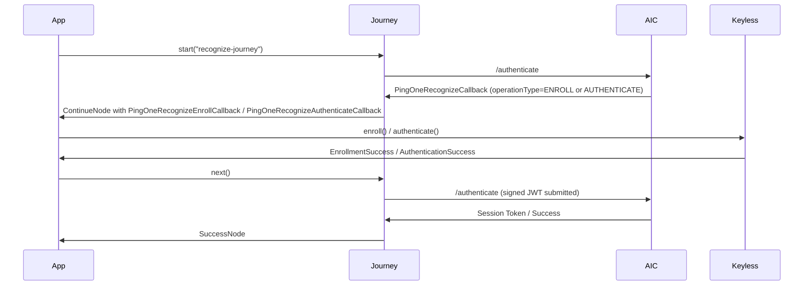

[](https://github.com/ForgeRock/ping-android-sdk)

# Recognize Module: PingOne Recognize Biometric Authentication

## Overview

The `recognize` module integrates [PingOne Recognize](https://docs.pingidentity.com/recognize/pingone-recognize.html) (powered by the Keyless biometric SDK) into both **Journey** and **DaVinci**-based authentication flows on Android. It handles biometric **enrollment** (registering a user's face) and **authentication** (verifying a returning user) through standard Journey callbacks and DaVinci collectors.

The module registers its callbacks and collectors automatically via AndroidX App Startup — no manual initialisation is required in your `Application` class.

### Supported operation types

| `operationType` | Purpose                           |
|-----------------|-----------------------------------|
| `ENROLL`        | Biometric enrollment ceremony     |
| `AUTHENTICATE`  | Biometric authentication ceremony |

---

## Requirements

- Android API 29+
- Java 17
- Kotlin coroutines

---

## Installation

```kotlin
implementation("com.pingidentity.sdks:recognize:<version>")
```

---

## Prerequisites: Journey / DaVinci Configuration

Configure a Journey or DaVinci flow in PingOne AIC that includes a **PingOne Recognize** node. The node produces either:

- A `PingOneRecognizeCallback` (Journey) with `operationType = "ENROLL"` or `"AUTHENTICATE"`
- A DaVinci connector response with the same `operationType` discriminator

All SDK parameters (API key, host, transaction data, liveness settings, etc.) are supplied by the server as output fields — the SDK maps them to `BiomEnrollConfig` / `BiomAuthConfig` automatically.

---

## Journey Integration

### How it works



Registration and Keyless SDK initialisation happen automatically at app startup — the `RecognizeKeylessInitializer` is declared as a dependency of `CallbackInitializer` in the module's `AndroidManifest.xml`.

### Handling the callback

The Journey framework returns either `PingOneRecognizeEnrollCallback` or `PingOneRecognizeAuthenticateCallback` depending on `operationType`. Call `enroll()` or `authenticate()` on the resolved callback, then advance the flow:

```kotlin
for await node in journey.start() {
    when (node) {
        is ContinueNode -> {
            node.callbacks.forEach { callback ->
                when (callback) {
                    is PingOneRecognizeEnrollCallback -> {
                        val result = callback.enroll()
                        result.onFailure { error ->
                            if (error is RecognizeException) {
                                Log.e("Recognize", "Enroll failed [${error.code}]: ${error.message}")
                            }
                        }
                    }
                    is PingOneRecognizeAuthenticateCallback -> {
                        val result = callback.authenticate()
                        result.onFailure { error ->
                            if (error is RecognizeException) {
                                Log.e("Recognize", "Auth failed [${error.code}]: ${error.message}")
                            }
                        }
                    }
                }
            }
            node.next()
        }
        is SuccessNode -> { /* authenticated */ }
        is FailureNode -> { /* journey-level failure */ }
    }
}
```

#### Retrieving the selfie frame (optional)

Both callbacks accept a `retrieveSelfie: Boolean` parameter. When `true`, the captured face frame is returned in `RecognizeSuccess.selfie` as a `Bitmap`. Every successful enroll or authenticate operation also retrieves the current device public signing key from the Keyless SDK and exposes it as `RecognizeSuccess.devicePublicSigningKey`. If key retrieval fails, the operation returns a failure rather than a successful result with an empty key.

```kotlin
val result = callback.enroll(retrieveSelfie = true)
result.onSuccess { success ->
    val selfie: Bitmap? = success.selfie
}
```

### Enrollment — server field mapping

| Callback field / `mobileSDKOptions` key         | `BiomEnrollConfig` property             |
|-------------------------------------------------|-----------------------------------------|
| `transactionData`                               | `jwtSigningInfo.claimTransactionData`   |
| `audience`                                      | `jwtSigningInfo.audience`               |
| `clientState`                                   | `clientState`                           |
| `generateClientState` (`"true"` → BACKUP)       | `generatingClientState`                 |
| `mobileSDKOptions.operationInfoId`              | `operationInfo.operationId`             |
| `mobileSDKOptions.operationInfoPayload`         | `operationInfo.payload`                 |
| `mobileSDKOptions.operationInfoExternalUserId`  | `operationInfo.externalUserId`          |
| `mobileSDKOptions.livenessConfiguration`        | `livenessConfiguration`                 |
| `mobileSDKOptions.livenessEnvironmentAware`     | `livenessEnvironmentAware`              |
| `mobileSDKOptions.cameraDelaySeconds`           | `cameraDelaySeconds`                    |
| `mobileSDKOptions.showSuccessFeedback`          | `showSuccessFeedback`                   |
| `mobileSDKOptions.showFailureFeedback`          | `showFailureFeedback`                   |
| `mobileSDKOptions.showInstructionsScreen`       | `showInstructionsScreen`                |
| `mobileSDKOptions.presentation`                 | `presentationStyle`                     |
| `mobileSDKOptions.numberOfEnrollmentCircuits`   | `setupConfig.numberOfEnrollmentCircuits`|

On success, `IDToken1signedJwt`, `IDToken1clientState`, and `IDToken1recognizeId` are submitted to the server automatically.

### Authentication — server field mapping

| Callback field / `mobileSDKOptions` key                  | `BiomAuthConfig` property               |
|----------------------------------------------------------|-----------------------------------------|
| `transactionData`                                        | `jwtSigningInfo.claimTransactionData`   |
| `audience`                                               | `jwtSigningInfo.audience`               |
| `generateClientState` (`"true"` → BACKUP)                | `generatingClientState`                 |
| `mobileSDKOptions.operationInfoId`                       | `operationInfo.operationId`             |
| `mobileSDKOptions.operationInfoPayload`                  | `operationInfo.payload`                 |
| `mobileSDKOptions.operationInfoExternalUserId`           | `operationInfo.externalUserId`          |
| `mobileSDKOptions.livenessConfiguration`                 | `livenessConfiguration`                 |
| `mobileSDKOptions.livenessEnvironmentAware`              | `livenessEnvironmentAware`              |
| `mobileSDKOptions.cameraDelaySeconds`                    | `cameraDelaySeconds`                    |
| `mobileSDKOptions.showSuccessFeedback`                   | `showSuccessFeedback`                   |
| `mobileSDKOptions.presentationStyle`                     | `presentationStyle`                     |
| `mobileSDKOptions.shouldRetriveAuthenticationFrame`      | `shouldRetrieveAuthenticationFrame`     |
| `mobileSDKOptions.numberOfEnrollmentCircuits`            | `setupConfig.numberOfEnrollmentCircuits`|

> **Note:** `shouldRetriveAuthenticationFrame` preserves the server-side typo (missing `e` in `Retrieve`) — this is the exact JSON key the server sends.

On success, `IDToken1signedJwt`, `IDToken1clientState`, and `IDToken1devicePublicSigningKey` are submitted automatically. The signing key is freshly retrieved from the Keyless SDK for each successful authentication. Journey enrollment retains its existing five-input contract, so its key is available through `RecognizeSuccess.devicePublicSigningKey` rather than a Journey input field.

#### Enroll-from-clientState (auth flow)

When the authenticate callback receives a non-empty `clientState` and `validateUserAndDeviceActive()` reports the user is not yet enrolled, it automatically falls back to `Recognize.enroll()` using that `clientState`. No extra handling is needed from the caller.

---

## DaVinci Integration

The module registers a `RecognizeCollector` factory automatically via `CollectorInitializer`. It reads the `operationType` field and returns either `RecognizeEnrollCollector` or `RecognizeAuthenticateCollector`, both of which implement `Collector<JsonObject>`.

The collectors chain `Recognize.setup → Recognize.enroll / Recognize.authenticate` and populate `formData.{key}` with a flat JSON object on both success and failure paths, so the server always receives a response including `clientError` and `clientErrorCode`.

DaVinci error mapping is partially implemented — `RecognizeException` failures are fully mapped; non-Recognize exceptions populate `clientError` only (code is empty, pending full DaVinci error mapping).

---

## Error Handling

All Recognize SDK failures are wrapped in `RecognizeException` before reaching the caller:

```kotlin
class RecognizeException(
    val code: Int,                          // Numeric code from KeylessSdkError
    override val message: String,           // Human-readable description
    val debuggingInfo: Map<String, String>, // FLOW_ID_KEY, SESSION_ID_KEY, STACK_TRACE_KEY, etc.
    cause: Throwable? = null,
) : Exception(message, cause)
```

The `code` and `message` are also written into the `clientErrorCode` and `clientError` input slots before the Journey / DaVinci flow advances, so the server receives the error detail regardless of how the app handles the `Result`.

---

## Troubleshooting

| Symptom | Possible Cause | Fix |
|---------|----------------|-----|
| `Keyless.configure` returns error | Wrong API key or host | Verify the values in the Journey/DaVinci node output |
| Camera never opens | Missing foreground `Activity` or wrong thread | Ensure `enroll()`/`authenticate()` is called from the main thread with a visible activity |
| Journey returns generic error after biometric success | Double submission | The callbacks submit inputs automatically — do **not** call `input()` manually |
| Liveness check too strict / lenient | Server default not suitable | Adjust `livenessConfiguration` in the AIC node settings |
| `"operationType" is required` | Journey/DaVinci node misconfigured | Check the PingOne Recognize node configuration in AIC |
| `RecognizeException.code` is always 0 | Older SDK version (pre-6.0.0) | Ensure `io.keyless:keyless-mobile-sdk:6.0.0` or later is used |

---

## License

This project is licensed under the MIT license. See the [LICENSE](../LICENSE) file for details.
